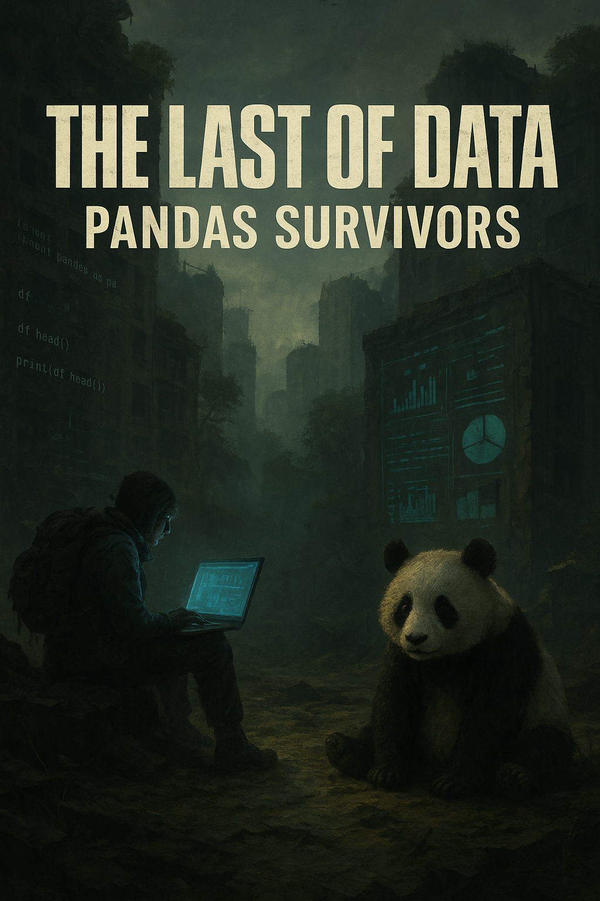

    

-------

# Projeto EBOOK Gerado por I.A.s (Pandas: O Último de Nós)

Projeto com o objetivo de gerar um ebook digital com as facilidades das ferramentas de IA, focado em **Análise de Dados com a biblioteca Pandas**. Todos os prompts utilizados para a criação do conteúdo e imagens seguem abaixo.

## 💻 Tecnologias utilizadas no projeto

- [ChatGPT](https://chat.openai.com/) 
- [MidJourney](https://www.midjourney.com/app/)
- [PowerPoint](https://www.microsoft.com/en/microsoft-365/powerpoint)

## 🧠 Prompts

### ChatGPT

|   Ação   | prompt                                                                                                                                                                                                                                         |
| :------: | ------------------------------------------------------------------------------------------------------------------------------------------------------------------------------------------------------------------------------------------------------------------------------ |
|  título  | Crie um título de um ebook sobre o tema de Pandas, o ebookk é do nicho de programação e o subnicho é de Análise de Dados, o título deve ser épico e curto, e tenha uma temática de Last of US no título, me liste 5 variações de títulos                                                        |
| conteúdo | Faça um texto para ebook , com foco em Pandas, listando os principais funções de Pandas com exemplos em código {REGRAS} Explique sempre de uma maneira simples Deixe o texto enxuto, Sempre traga exemplos de código em contextos reais , sempre deixe um título sugestivo por tópico |

### Midjourney (Para Capa e Ilustrações)

|  Ação  | prompt                                                                                 |
| :----: | -------------------------------------------------------------------------------------- |
| capa | A last of us survivor, with pandas simbol in this shirt, pixel art style --v 5.1 |
| Imagens | **Capa:** Cidade destruída, prédios tomados por natureza, mas em vez de grafites e cartazes, há códigos Python e gráficos de dados projetados nas paredes. Um panda estilizado em meio ao caos, como mascote sobrevivente. |
| Imagens | **Introdução:** Um sobrevivente com mochila e laptop, sentado entre ruínas, com uma planilha holográfica iluminando o rosto. |
| Imagens | **Lendo Dados:** Um baú/cofre aberto no chão, de onde saem arquivos CSV brilhando como se fossem artefatos preciosos. |
| Imagens | **Explorando Dados:** Uma lupa enferrujada iluminando uma tabela de dados flutuante em meio a destroços. |
| Imagens | **Selecionando Dados:** Caminhos quebrados na cidade, cada um levando a uma tabela/coluna diferente (metáfora de .loc e .iloc). |
| Imagens | **Agrupando Dados:** Vários sobreviventes em volta de uma fogueira, cada um segurando gráficos, que se juntam num dashboard único no ar. |
| Imagens | **Tratando Dados Ausentes:** Um mural de tabela com buracos (valores nulos), sendo “tapados” com placas de metal ou preenchidos com luz. |
| Imagens | **Conclusão:** Horizonte com cidade reconstruída, prédios misturados à natureza, e torres de servidores brilhando como símbolos de renascimento. |

## ✨ Features

- Conteúdo gerado via **ChatGPT**
- Imagens temáticas geradas via **MidJourney** (com temática *The Last of Us*)
- Foco em **Análise de Dados com a biblioteca Pandas**

## 📚 Materiais

- Imagens utilizadas em `assets`
- ebook gerado em `output`

## 🛠️ Instruções de execução

Utilize os prompts de texto e as descrições de imagem nas ferramentas sugeridas para gerar o material base e utilize uma ferramenta de edição de documentos (como Power Point, LibreOffice, InDesign, etc.) para a diagramação.

## 👨‍💻 Expert

    &nbsp;&nbsp;&nbsp;**Rui Diniz** 
    &nbsp;&nbsp;&nbsp;
    <a href="https://github.com/Dev-RuiDiniz">
    GitHub</a>&nbsp;|&nbsp;
    <a href="https://www.linkedin.com/in/rui-francisco-de-paula-inácio-diniz-868195301">LinkedIn</a>

  

---

⌨️ com 💜 por [Rui Diniz](https://github.com/Dev-RuiDiniz)